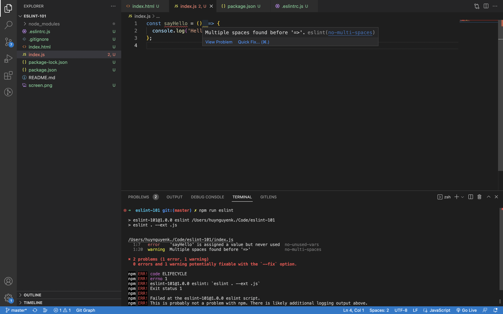

# ESLint

<p align="center">
  
</p>

## Introduction

ESLint is a tool for identifying and reporting on patterns found in ECMAScript/JavaScript code, with the goal of making code more consistent and avoiding bugs.

## Installation

- Create a `package.json` file:
  ```js
  npm init -y
  ```
- Install the `eslint` package as dev dependency:
  ```js
  npm install eslint --save-dev
  ```
- Create `.eslintrc.js` ESLint configuration file:
  ```js
  module.exports = {
    env: {
      browser: true,
      node: true,
      es6: true,
    },
    extends: ['eslint:recommended'],
    parserOptions: {
      ecmaVersion: 'latest',
      sourceType: 'module',
    },
    plugins: [],
    rules: {
      'no-multi-spaces': [1],
      'object-curly-spacing': [2, 'always']
    },
  };
  ```
- Add ESLint script to `package.json` file to run ESLint (more about [CLI](https://eslint.org/docs/latest/user-guide/command-line-interface)):
  ```js
  "eslint": "eslint . --ext .js"
  ```

## Configuration
### `env`

An environment provides predefined global variables. The available environments are:

- `browser` - browser global variables.
- `node` - Node.js global variables and Node.js scoping.
- `es6` - enable all ECMAScript 6 features except for modules.

### `extends`

This feature allows you to use config of other people. 

This `extends: ['eslint:recommended']` adds support for basic recommended `ESLint` rules. 

Using `eslint:recommended` is fine but it does not cover all styles guidelines. There are more usable and widely used guidelines in all projects provided by `Airbnb` which you can access [here](https://github.com/airbnb/javascript).

### `parserOptions`

By default, ESLint expects ECMAScript 5 syntax. You can override that setting to enable support for other ECMAScript versions as well as JSX by using parser options. The available options are:

- `ecmaVersion` - set to 3, 5 (default), 6, 7, 8, 9, 10, 11, 12, 13, or 14 to specify the version of ECMAScript syntax you want to use. You can also set “latest” to use the most recently supported version.
- `sourceType` - set to `'script'` (default) or `'module'` if your code is in ECMAScript modules.
- `ecmaFeatures` - an object indicating which additional language features you’d like to use:
    - `globalReturn` - allow `return` statements in the global scope
    - `impliedStrict` - enable global [strict mode](https://developer.mozilla.org/en-US/docs/Web/JavaScript/Reference/Strict_mode) (if `ecmaVersion` is 5 or greater)
    - `jsx` - enable [JSX](https://facebook.github.io/jsx/)

### `plugins`

ESLint supports the use of third-party plugins. A plugin is an extension for ESLint that will enforce rules, that are not implemented into the ESLint core. To configure plugins inside of a configuration file, use the `plugins` key, which contains a list of plugin names.

### `rules`

ESLint comes with a large number of built-in rules and you can add more rules through plugins. The rule syntax: 

```jsx
rule-name: [rule-id, rule-options-object]
```

The rule ID equal to one of these values:

- `"off"` or `0` - turn the rule off
- `"warn"` or `1` - turn the rule on as a warning (doesn’t affect exit code)
- `"error"` or `2` - turn the rule on as an error (exit code is 1 when triggered)

See all available rules and their options [here](https://eslint.org/docs/latest/rules/).

## Usage

You should download [VSCode ESLint extension](https://marketplace.visualstudio.com/items?itemName=dbaeumer.vscode-eslint) to integrate ESLint into your VS Code. The extension uses the ESLint library installed in the opened workspace folder to check syntax and find problems in your code. You can also use CLI to check your code:

```js
npm run eslint
```



### Disabling Rules

You can disable rules by using configuration comments or configuration files. More detail [here](https://eslint.org/docs/latest/user-guide/configuring/rules#disabling-rules).